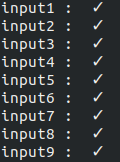

# Documentação e Analises
* [PDF](http://www.dropwizard.io/1.0.2/docs/)
* [Jupyter](https://github.com/Leostayner/Simulation2DPhysics/tree/master/jupyter/)


# Como Rodar os Testes
  [Testes](https://github.com/Leostayner/Simulation2DPhysics/tree/master/test/)
  
  Os testes foram implementados com o uso de um script python responsável por realizar as comparações do resultado de saída do programa com o resultado esperado. Para rodar os testes basta executar o comando python3 test.py, Caso queira adicionar um novo teste deve-se criar um novo arquivo input.txt (entrada para o código principal ), assim como um arquivo output.txt (resultado esperado), a estrutura desses arquivos deve seguir os padrões do projeto.

Em seguida deve-se adicionar o nome destes arquivos recém criados a lista de testes dentro do script. Ao executar o script obtém-se o seguinte layout.




## Padrões do Projeto
### Input
```
w h mu_d
N
m wr hr x y vx vy 
.... 
m wr hr x y vx vy 
dt print_freq max_iter
```
w, h e mu_d se referem ao tamanho do campo de simulação e seu coeficiente de atrito dinâmico.  
N é o número de retângulos da simulação. 
Cada linha subsequente contém um retângulo com as seguintes propriedades:  
massa m  
largura wr  
altura hr  
posição inicial (x, y)  
velocidade inicial (vx, vy)  
dt representa o tamanho do passo de simulação.  
a cada print_freq iterações o estado da simulação é mostrado na saída padrão.  
a simulação deverá rodar até max_iter vezes. Note que ela pode acabar antes.  

## Output
A cada print_freq iterações o programa mostra o estado atual da simulação no seguinte formato.  
```
iter
x1 y1 vx1 vy1
...
xN yN vxN vyN
--------
```
Obs: não deve haver espaços vazios no final de cada linha, assim como linhas vazias no final do arquivo


